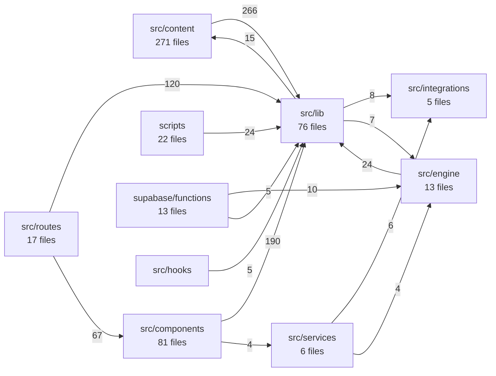

# Repo map

Generated 2026-07-30 from commit `1dcc3ae` by `node scripts/repo-map.mjs`, with the
client↔database boundary checked against the live Supabase project rather than against
the migration files alone.

`/graphify` is the canonical mapper for this repo, but it is a local plugin and is not
installed in Claude Code web containers. `scripts/repo-map.mjs` is the portable
stand-in: TypeScript compiler API only, no new dependencies, same gitignored
`graphify-out/` output directory.

**This is a "where to read" map, not a liveness oracle.** An import or call edge proves
the call is reachable, not that the work happens. §6 says what it cannot see, and what to
run instead.

---

## 1. The three connections

|          | Identity                                                                                                                           | Verified how                                                        |
| -------- | ---------------------------------------------------------------------------------------------------------------------------------- | ------------------------------------------------------------------- |
| GitHub   | `nykefleym-pbi/pokemontrivia` (repo id `1232665970`, public)                                                                       | git remote + authenticated as `nykefleym-pbi`                       |
| Supabase | `PokemonTriviaBattle` — ref `dvdorceiasaipdvyfhil`, ap-northeast-1, Postgres 17.6, `ACTIVE_HEALTHY`                                | matches `supabase/config.toml`; queried `pg_proc` / `pg_class` live |
| Vercel   | `pokemontriviabattle` — `prj_wQdzARjTsJgGcWY7mpWd6RUjIpAS`, team `nykefleym-9286s-projects`, framework `tanstack-start`, Node 24.x | deployment metadata carries `githubRepoId 1232665970`               |

The wiring between them: `main` → Vercel **production** (`pokemontriviabattle.vercel.app`),
every other branch → a preview deployment, and PR branches get a `githubPrId` in their
deployment metadata. Last production deploy is `1dcc3ae` on `main`. Supabase is reached at
runtime through `VITE_SUPABASE_*` (browser) and `SUPABASE_*` (server) — eight variables,
listed in `.env.example`, no service-role key among them; the service-role key lives only
in Edge Function secrets. Edge Functions do not deploy with the Vercel build at all: they
go out through `.github/workflows/deploy-edge-function.yml`, which is `workflow_dispatch`
only — one function and one project ref per manual run, nothing fires on push.

## 2. Shape

508 production modules, 68,851 lines, plus 58 test modules at 10,906 lines. 5,957
declarations of which 1,074 are exported. 1,756 internal import edges, 389 distinct
external ones, 820 resolved cross-file call edges.

| Layer                | Files | Lines  |
| -------------------- | ----- | ------ |
| `src/lib`            | 76    | 27,221 |
| `src/components`     | 81    | 16,675 |
| `src/routes`         | 17    | 8,198  |
| `src/content`        | 271   | 4,880  |
| `scripts`            | 22    | 3,310  |
| `src/engine`         | 13    | 2,775  |
| `supabase/functions` | 13    | 2,574  |
| `src/integrations`   | 5     | 2,337  |
| `src/services`       | 6     | 401    |
| `src/hooks`          | 2     | 289    |
| `src/*` (router, sw) | 2     | 191    |

`src/content` is 53% of the files and 7% of the lines — one small module per ability, item
and status. That is the shape a catalog should have, and it is why the collision list in §5
is long without anything being wrong.

The dependency direction, aggregated (edge counts, production only):



The layering is clean in the direction that matters: nothing under `src/content` or
`src/engine` imports a component or a route, so the catalog and the rules can be read and
tested without the UI. The one edge worth pointing at is `supabase/functions → src/engine`
(10 edges) — the shared rule engine that makes server-authoritative turns possible, the
same TypeScript running in the browser and in Deno. It is also why
`scripts/bundle-edge-function.mjs` exists: `supabase functions deploy` cannot see imports
that climb out of the function's own directory.

There is no back-edge from `src/lib` into `src/routes`. (An earlier pass of this map showed
17 of them; every one was `src/routeTree.gen.ts`, which the mapper now skips as a build
artefact.)

## 3. Where the weight is

Most depended upon:

| Module                                             | Fan-in | Lines |
| -------------------------------------------------- | ------ | ----- |
| `src/lib/signature-abilities.ts`                   | 132    | 2,968 |
| `src/lib/signature-engine-describe.ts`             | 108    | 515   |
| `src/content/abilities/signature/signature-def.ts` | 106    | 17    |
| `src/lib/pvp-type-abilities.ts`                    | 64     | 504   |
| `src/lib/game-data.ts`                             | 62     | 602   |
| `src/content/abilities/rolled/rolled-def.ts`       | 58     | 77    |
| `src/lib/store.ts`                                 | 58     | 767   |
| `src/content/abilities/type/type-def.ts`           | 56     | 18    |
| `src/content/items/item-def.ts`                    | 51     | 74    |
| `src/lib/utils.ts`                                 | 43     | 7     |

Largest:

| Module                                      | Lines  | Fan-in |
| ------------------------------------------- | ------ | ------ |
| `src/lib/pokemon-data.generated.ts`         | 10,285 | 7      |
| `src/lib/signature-abilities.ts`            | 2,968  | 132    |
| `src/components/live-pvp-battle-screen.tsx` | 2,433  | 3      |
| `src/integrations/supabase/types.ts`        | 2,175  | 3      |
| `src/routes/profile.tsx`                    | 1,639  | 0      |
| `src/components/battle-screen.tsx`          | 1,599  | 4      |
| `src/lib/pvp-live.ts`                       | 1,530  | 10     |
| `src/lib/trainer-data.generated.json`       | 1,473  | 1      |
| `src/routes/battle.tsx`                     | 1,140  | 0      |
| `src/routes/pvp.live.$matchId.tsx`          | 1,056  | 0      |

(Routes show fan-in 0 because TanStack reaches them through the generated route tree, which
this map skips — they are entry points, not orphans.)

Three of the top four are generated or catalog files. The ones that are neither —
`live-pvp-battle-screen.tsx` at 2,433 lines and `pvp-live.ts` at 1,530 — are the live-PvP
hot spot, and between them they are where a reader should expect to spend time.

`signature-abilities.ts` at fan-in 132 is the single highest-leverage file in the repo:
just over a quarter of all modules import it. Read §6 before changing it.

Of 46 files in `src/components/ui/` (the shadcn kit), 30 have fan-in 0 — vendored
components nothing imports. Not dead code in the dangerous sense, just unused kit.

## 4. The client ↔ database boundary

**48 RPC names** are called from code. All 48 exist in the live database. Two of them —
`apply_pvp_live_answer_v2` and `apply_bot_pvp_move_v2` — have had `execute` revoked from
`authenticated`, and the map confirms the only caller of either is
`supabase/functions/pvp-live-resolve-turn/index.ts`, which runs service-role. The trust
boundary holds: nothing in `src/` can reach them.

`forfeit_live_pvp_match` and `pick_battle_curated` each exist twice in the database
(overloads, as expected from `20260726140000_pick_battle_curated_accepts_a_band.sql`).

**Migration drift, both directions.** This map originally found four functions living in the
database with no `create function` for them anywhere in `supabase/migrations/`:

| Function                          | Called from                                                    | Status                                                       |
| --------------------------------- | -------------------------------------------------------------- | ------------------------------------------------------------ |
| `get_mega_leaderboard`            | `src/lib/mega/runs.ts`, `supabase/functions/mega-reward-claim` | fixed — `20260730035753_mega_rpcs_backfill_and_lockdown.sql` |
| `insert_mega_questions_if_absent` | `src/routes/api.mega-questions.ts`                             | fixed — same migration, plus an anon-execute revoke          |
| `_pvp_index_shield_zero`          | engine-internal                                                | still undeclared; helper, not client-facing                  |
| `rls_auto_enable`                 | —                                                              | still undeclared; platform/setup helper                      |

The two client-facing ones are now declared, transcribed verbatim from
`pg_get_functiondef()` so the backfill is a no-op replace against production and a faithful
create on a fresh project. Backfilling the first one also surfaced a live privilege bug:
`insert_mega_questions_if_absent` is SECURITY DEFINER, writes into the deny-all
`mega_event_questions`, and carried the default PUBLIC execute grant, so any holder of the
anon key could call it — and since the insert is `on conflict (event_id) do nothing`, the
first writer for an `event_id` wins, letting an anonymous caller pre-seed a future raid's
50 questions and silently discard the server's set. Its only caller is
`api.mega-questions.ts` through `supabaseAdmin`, so execute is now service-role only.

Four functions run the other way — defined in migrations but no longer in the database,
which is the expected residue of deliberate drops: `check_curated_answer`, `gen_friend_code`,
`submit_bot_pvp_move`, `submit_pvp_live_answer` (the last two dropped by
`20260719000000_pvp_live_answer_drop_old_rpcs.sql`).

**13 Edge Functions** in the repo (12 plus `_shared`), and exactly 12 deployed and
`ACTIVE` — a clean 1:1. Eight are invoked from code (`battle-solo`, `daily-run`,
`mega-run`, `mega-reward-claim`, `pvp-live-resolve-turn`, `save-sync`, `send-push`,
`whos-that`). Three of the remaining four are reached from the database instead of from
code, which is why no invoke site exists: `daily-reminders` by cron
(`20260703120100_push_cron_jobs.sql`), `chat-report-to-issue` by webhook
(`20260719122000_pvp_chat_report_webhook.sql`), `feedback-to-issue` by trigger
(`20260707111000_feedback_to_issue_trigger.sql`). **`rewards-grant` has no caller of any
kind in this repo** — deployed and ACTIVE, named in the comments of three migrations and in
`save-sync`'s own source comments as the precedent it follows, but never invoked. Worth
confirming against production logs before assuming either way.

**30 tables**, every one with RLS enabled. Seven have RLS on and zero policies, i.e.
deny-all to `anon`/`authenticated`, reachable only through SECURITY DEFINER functions:
`app_config`, `chat_banned_words`, `curated_questions`, `mega_event_questions`,
`pvp_chat_reports`, `pvp_live_answer_shadow_log`, `pvp_type_ability_effects`. Two of those
are read with a direct `.from()` rather than an RPC — `mega_event_questions` from
`src/routes/api.mega-questions.ts` and `pvp_live_answer_shadow_log` from
`scripts/pvp-shadow-verify/run.ts` — and both are server-side callers holding a
service-role or server key, so the deny-all does not apply to them. No browser code reads
a policy-less table.

Row counts worth carrying in your head: `pvp_signature_effects` 104,
`pvp_live_answer_shadow_log` 762, `curated_questions` ~4,000, `pvp_live_matches` 74.

## 5. Name collisions

62 exported names are declared in more than one production file. This is the check
graphify is genuinely best at — it is how the duplicate `clampStage` was found — so the
list is worth reading rather than skimming. Full data in `graphify-out/collisions.json`.

**Structural, expected, not a problem — 55 of the 62:** `Route` (17 files, one per TanStack
file route), and 54 ability names appearing once in `src/content/abilities/rolled/` and once
in `src/content/abilities/type/` (`blaze`, `sturdy`, `shieldDust`, `staticAbility`, …). Two
catalogs, one vocabulary, by design.

**The seven that are neither:**

| Name                   | Declared in                                                     |
| ---------------------- | --------------------------------------------------------------- |
| `ALL_POKEMON`          | `src/lib/pokemon-data.generated.ts`, `src/lib/pokemon-data.ts`  |
| `TRAINER_SPRITES`      | `src/lib/trainer-data.generated.ts`, `src/lib/game-data.ts`     |
| `StatusKind`           | `src/content/statuses/status-def.ts`, `src/engine/turn.ts`      |
| `MAX_ITEMS_PER_BATTLE` | `src/lib/store/slices/itemsSlice.ts`, `src/engine/turn.ts`      |
| `MEGA_BOSS_HP`         | `src/lib/mega/schedule.ts`, `src/engine/mega-replay.ts`         |
| `MegaHealItemId`       | `src/engine/mega-replay.ts`, `src/engine/mega-battle-replay.ts` |
| `DailyMark`            | `src/lib/store/types.ts`, `src/components/game-ui.tsx`          |

The first two are re-exports of generated data and almost certainly fine. The interesting
ones are `MAX_ITEMS_PER_BATTLE` and `MEGA_BOSS_HP` — two independent declarations of a
single game constant, where a reader who imports the wrong one gets code that compiles and
is quietly wrong — and `MegaHealItemId`, declared in two engine modules whose names differ
by one word. **These are flagged as places to read carefully, not as confirmed bugs.**
Verifying any of them means the falsification loop in `CLAUDE.md`, not a second reading of
the source.

## 6. What this map cannot see

Everything `CLAUDE.md` warns about, which is exactly why the map is not the last word:

1. **Liveness.** A function can be exported, imported, called from the live battle screen
   and backed by production rows, and still return early on a guard. Names, call edges and
   database rows cannot see that. Run the oracle:

   ```
   npx vite-node -c scripts/balance-sim/vite.config.ts scripts/balance-sim/liveness.ts
   ```

   Run against this commit it reports: catalog 104 rows / 104 with an engine spec, so every
   engine guard is always true; six named delivery paths are already GONE from source; and
   exactly one path is LIVE — `hasCappedPayload`, which carries no engine guard and delivers
   the `phase='manual'` database rows auto-fired by `fireCappedPayload`. Zero paths are
   currently dead-but-present. Trust that output over this document.

2. **The second implementation.** `apply_pvp_live_answer_v2` recomputes streak, wrong-streak
   and confusion in PL/pgSQL and ignores `_next_state` for those columns, while its bot twin
   `apply_bot_pvp_move_v2` stores what the engine handed it. A rule added to
   `engine/pvp-live-answer.ts` therefore takes effect for the bot and does nothing for the
   player. The map shows both RPCs as one edge each from one Edge Function; it cannot show
   that the two disagree.

3. **`manual`.** TypeScript says `capped_payload`; the database phase token is still the
   string `'manual'`, and 20 production rows carry it. Two vocabularies, one word — see
   `CLAUDE.md`.

4. **`scripts/` is not in `tsconfig.json`.** `tsc --noEmit` does not check it, so a stale
   string comparison in the simulator compiles fine and silently un-wires abilities. That
   applies to `scripts/repo-map.mjs` too: it is linted and formatted, but not type-checked.

## 7. Rebuilding it

```bash
node scripts/repo-map.mjs        # -> graphify-out/{graph.json,collisions.json,boundary.json}
/graphify                        # canonical, when the plugin is available; extract(parallel=False)
```

`graphify-out/` is gitignored. Rebuild it rather than trusting the numbers above if the
tree has moved; regenerate this document if the shape has. When rebuilding with graphify
itself, do it sequentially — the parallel pool crashes on this repo and silently emits a
graph with a third of the nodes.
